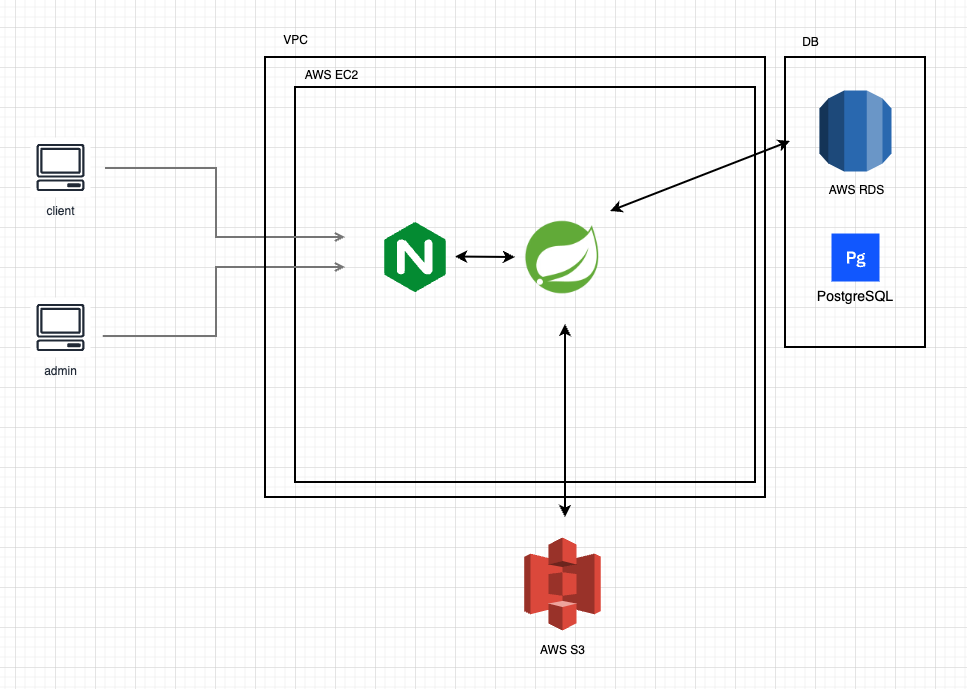
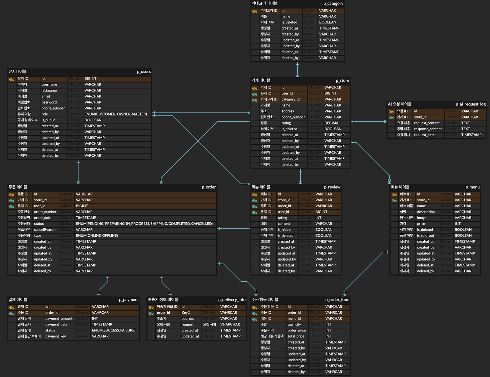

# Gamja Quick

💡 본 프로젝트는 내일배움캠프 Spring Java 심화 부트캠프 첫 번째 프로젝트의 결과물 입니다.

## 🔗 배포 링크

[🔗** Gamja Quick 바로가기 **](http://3.34.143.207/swagger-ui/index.html)

## 📌 프로젝트 소개

개발 공부 중인 자칭 ' **감자** ' 들이 만든,<br>
음식점들의 배달 및 포장 주문 관리, 결제, 주문 내역 관리 기능을 제공하는 **음식 주문 관리 플랫폼: Gamja Quick** 입니다.

### 개발 기간

2024년 11월 6일 수요일 ~ 11월 18일 월요일

### 프로젝트 목표

- Spring Boot를 활용해 **모놀리식 아키텍처 기반 어플리케이션 개발**을 경험합니다.
- **JWT 인증 및 권한 관리**를 통한 보안 시스템을 구축해봅니다.
- 주어진 최소한의 요구사항을 바탕으로 직접 핵심 요구사항 분석 및 작성, 데이터베이스 설계, ERD 작성, RESTful API 설계를 실천해봅니다.
- **협업 개발 환경(Git 활용)** 에서 코드 리뷰, 컨벤션, 브랜치 전략을 적용해봅니다.
- 간단한 클라우드 배포를 통해 서비스 배포 및 운영 환경을 경험합니다.

### 주요 기능 요약

- 사용자 : 음식 주문 및 결제를 진행
- 관리자 & 가게 주인 : 주문과 메뉴를 관리
- JWT 인증 기반의 사용자 관리와 AI API 연동을 통해 상품 설명 자동 생성 기능 제공

<br>

## 📌 팀원 역할 분담

### 팀원 소개

|문병민|고혜정|김난영|조승아|
|:---:|:---:|:---:|:---:|
|백엔드, 팀장|백엔드, 팀원|백엔드, 팀원|백엔드, 팀원|
|[qudalsrnt3x](https://github.com/qudalsrnt3x)|[ykybkoft](https://github.com/ykybkoft)|[nyungnim](https://github.com/nyungnim)|[hiimsajo](https://github.com/hiimsajo)|
|||||
|[🔗 Tistory](https://byungmin.tistory.com/)|[🔗 Notion](https://flat-decimal-106.notion.site/COURSE-8-Spring-135ad8c00e57803abf9fce8a9d03ea08)|[🔗 Tistory](https://nyungtil.tistory.com/)|[🔗 Velog](https://velog.io/@hiimsa/posts)|

### 담당 업무

**_도메인 별로 담당 업무를 나누어 진행한 후 진행 상황에 따라 담당 업무를 추가했습니다.._**

#### 도메인 분류

- 문병민 님 : `카테고리`, `가게`, `AI api`
  - 프로젝트 설정 파일 작성 : 공통 응답, 검색, 페이징 형식 작성, application.yml
  - AWS 배포
  - 프로젝트 에러 수정
- 고혜정 님 : `메뉴`, `배송지`, `리뷰`
  - Swagger API 문서 자동화 진행, API 통합 테스트 진행
  - 프로젝트 에러 수정
- 김난영 님 : `사용자`, `리뷰`
  - Spring Security & JWT 인증 및 권한 관리, 테스트 진행
  - 개발 문서 작성 : 팀 노션, 프로젝트 readme, 프로젝트 결과물 정리본
- 조승아 님 : `주문`, `주문항목`, `결제`
  - 주문 관련 도메인 및 결제 테스트 진행
  - 프로젝트 에러 수정


<br>

## 📌 서비스 구성 및 실행 방법

### 기술 스택

#### 백엔드

- JDK 21
- Springboot 3.3.5
- Spring Security
- JPA

#### 데이터베이스

- PostgreSQL

#### 보안

- JWT

#### 빌드 & 배포

- Gradle
- Git & Github
- AWS

#### API 문서화 및 테스트

- Swagger
- Postman

### 서비스 아키텍처



### ERD



### API 관련

#### 1. API 명세서

[🔗 링크](https://nyunglog.notion.site/API-1368d83fd09e80cbba76e821f13dfba4?pvs=4)에서 확인해주세요.

#### 2. Swagger 문서 링크

[🔗** Swagger 문서 바로가기 **](http://3.34.143.207/swagger-ui/index.html)

### 프로젝트 구조

```
.
├── GamjaQuickApplication.java
├── airequestlog
│   ├── entity
│   │   └── AiRequestLog.java
│   ├── repository
│   │   └── AiRequestLogRepository.java
│   └── service
│       └── AiRequestLogService.java
├── category
│   ├── controller
│   │   └── CategoryController.java
│   ├── dto
│   │   ├── request
│   │   └── response
│   ├── entity
│   │   └── Category.java
│   ├── repository
│   │   ├── CategoryRepository.java
│   │   ├── CategoryRepositoryCustom.java
│   │   └── CategoryRepositoryImpl.java
│   └── service
│       └── CategoryService.java
├── common
│   ├── AuditingFields.java
│   ├── request
│   │   ├── SearchParameter.java
│   │   └── StoreSearchParameter.java
│   └── response
│       ├── ApiResponseDto.java
│       ├── ErrorResponseDto.java
│       ├── MessageType.java
│       └── PageResponseDto.java
├── config
│   ├── jpa
│   │   └── JpaConfig.java
│   ├── security
│   │   ├── CustomAuthenticationEntryPoint.java
│   │   ├── SecurityConfig.java
│   │   ├── UserDetailsImpl.java
│   │   ├── UserDetailsServiceImpl.java
│   │   └── jwt
│   └── web
│       ├── ObjectMapperConfig.java
│       └── RestTemplateConfig.java
├── global
│   ├── error
│   │   ├── ErrorCode.java
│   │   ├── GlobalExceptionHandler.java
│   │   └── exception
│   ├── swagger
│   │   ├── ApiErrorCodeExample.java
│   │   ├── ApiErrorCodeExamples.java
│   │   ├── ExampleHolder.java
│   │   └── config
│   └── util
│       └── JsonConvertUtil.java
├── infra
│   ├── ai
│   │   ├── client
│   │   ├── config
│   │   ├── dto
│   │   └── service
│   └── aws
│       ├── config
│       └── provider
├── menu
│   ├── controller
│   │   └── MenuController.java
│   ├── dto
│   │   ├── request
│   │   └── response
│   ├── entity
│   │   └── Menu.java
│   ├── repository
│   │   └── MenuRepository.java
│   └── service
│       └── MenuService.java
├── order
│   ├── controller
│   │   └── OrderController.java
│   ├── dto
│   │   ├── request
│   │   └── response
│   ├── entity
│   │   ├── DeliveryInfo.java
│   │   ├── Order.java
│   │   ├── OrderStatus.java
│   │   └── OrderType.java
│   ├── repository
│   │   ├── DeliveryInfoRepository.java
│   │   └── OrderRepository.java
│   └── service
│       └── OrderService.java
├── orderItem
│   ├── controller
│   │   └── OrderItemController.java
│   ├── dto
│   │   ├── request
│   │   └── response
│   ├── entity
│   │   └── OrderItem.java
│   ├── repository
│   │   └── OrderItemRepository.java
│   └── service
│       └── OrderItemService.java
├── payment
│   ├── controller
│   │   └── PaymentController.java
│   ├── dto
│   │   ├── request
│   │   └── response
│   ├── entity
│   │   ├── Payment.java
│   │   └── PaymentStatus.java
│   ├── repository
│   │   └── PaymentRepository.java
│   └── service
│       └── PaymentService.java
├── review
│   ├── controller
│   │   └── ReviewController.java
│   ├── dto
│   │   ├── request
│   │   └── response
│   ├── entity
│   │   └── Review.java
│   ├── repository
│   │   └── ReviewRepository.java
│   └── service
│       ├── ReviewService.java
│       └── ReviewServiceImpl.java
├── store
│   ├── controller
│   │   └── StoreController.java
│   ├── dto
│   │   ├── request
│   │   └── response
│   ├── entity
│   │   ├── Region.java
│   │   ├── Store.java
│   │   └── StoreStatus.java
│   ├── repository
│   │   ├── StoreRepository.java
│   │   ├── StoreRepositoryCustom.java
│   │   └── StoreRepositoryImpl.java
│   └── service
│       └── StoreService.java
├── upload
│   ├── controller
│   │   └── FileUploadController.java
│   ├── dto
│   │   └── response
│   ├── entity
│   │   └── FileInfo.java
│   ├── provider
│   │   └── FileUploader.java
│   ├── repository
│   │   └── FileRepository.java
│   └── service
│       └── FileUploadService.java
└── user
    ├── controller
    │   └── UserController.java
    ├── dto
    │   ├── request
    │   └── response
    ├── entity
    │   ├── RoleType.java
    │   └── User.java
    ├── repository
    │   └── UserRepository.java
    └── service
        ├── UserService.java
        └── UserServiceImpl.java

```

### 실행방법

1. **Repository 클론**

```
git clone https://github.com/JellyfishEgg/gamja-quick.git
cd gamja-quick
```

2. 데이터베이스 생성 및 설정

- PostgreSQL에서 `gamjaquick` 데이터베이스 생성

```
CREATE DATABASE gamja;
```

- `application.yml` 파일에서 데이터베이스 설정 및 수정

```
spring:
  datasource:
    url: jdbc:postgresql://localhost:5432/gamjaquick
    username: your_username
    password: your_password
```

3. 어플리케이션 실행

- 프로젝트 빌드
```
./gradlew build
```

- 프로젝트 실행
```
gradle run
```

